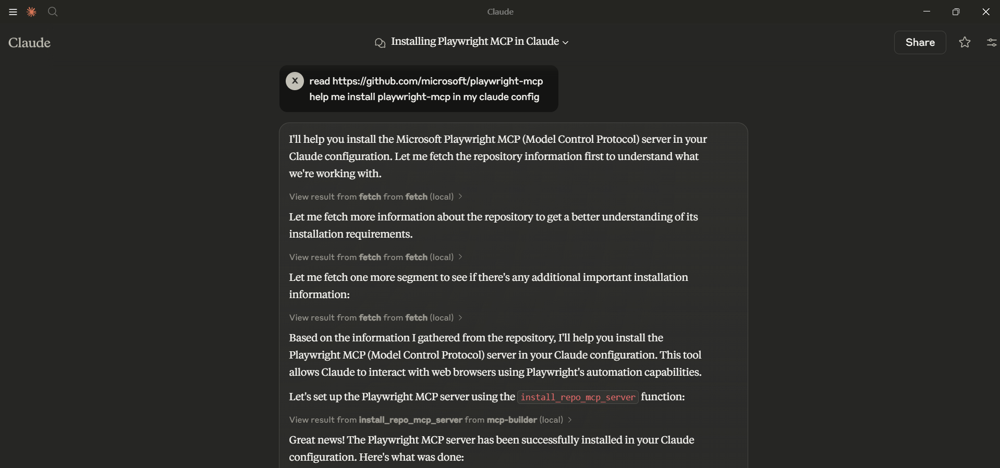

# mcp-builder

A Python-based MCP server to install other MCP servers. 

The purpose of this server is to provide a complete, user-friendly, and cross-platform way to install and configure MCP servers. 

## TODO

- [] Support for more MCP Clients (e.g. Cursor, Windsurf, ...)

- [] Support for more MCP server types and sources (e.g., Node.js, Java, etc.)
  
- [] Support recovery mechanism for failed installations
  
- ...


## Features

- **Package Repository Installation**: Install MCP servers from PyPI or npm packages
- **Local Installation**: Install MCP servers from local directories
- **Configuration Management**: Configure environment variables and arguments for installed servers
- **Automatic Detection**: Automatically detect the type of MCP server (Node.js or Python)
- **Cross-Platform Support**: Works on Windows, macOS, and Linux

## Requirements

- Python 3.10 or higher
- pip (for Python packages)
- Node.js and npm (optional, for JavaScript packages)

## Installation

### Install from Source

```bash
git clone https://github.com/xd3an/mcp-builder.git
cd mcp-builder
pip install -e .
```

## Usage

### Running Directly

After installation, you can run the MCP Builder directly:

```bash
# Using the entry point
mcpbuilder

# Or as a module
python -m mcp_builder.server
```

### Development Mode

For development and testing, you can use the MCP CLI tools:

```bash
# Install MCP CLI tools
pip install "mcp[cli]"

# Run in development mode
mcp dev path/to/mcp_builder/server.py

# npx @modelcontextprotocol/inspector
npx @modelcontextprotocol/inspector python -m mcp_builder.server
```

### MCP Client Integration

#### Claude Desktop Integration

To use MCP Builder with Claude Desktop, add it to your `claude_desktop_config.json` file:

```json
{
  "mcpServers": {
    "mcp-builder": {
      "command": "python",
      "args": [
        "-m",
        "mcp_builder.server"
      ]
    }
  }
}
```

The configuration file is located at:
- Windows: `%APPDATA%\Claude\claude_desktop_config.json`
- macOS: `~/Library/Application Support/Claude/claude_desktop_config.json`
- Linux: `~/.config/Claude/claude_desktop_config.json`

#### Example Commands

Once integrated with Claude Desktop, you can ask Claude to:

> read https://github.com/microsoft/playwright-mcp
help me install playwright-mcp in my claude config



## How It Works

MCP Builder modifies the Claude Desktop configuration file to register MCP servers. It supports:

1. **Node.js Packages**: Installs using `npx` and configures Claude to use them
2. **Python Packages**: Configures Claude to use Python modules
3. **Local Repositories**: Installs dependencies and configures Claude to use local code


